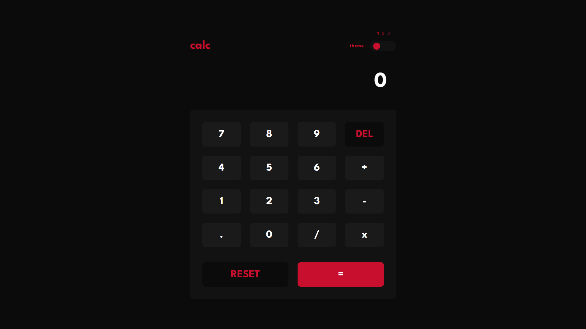
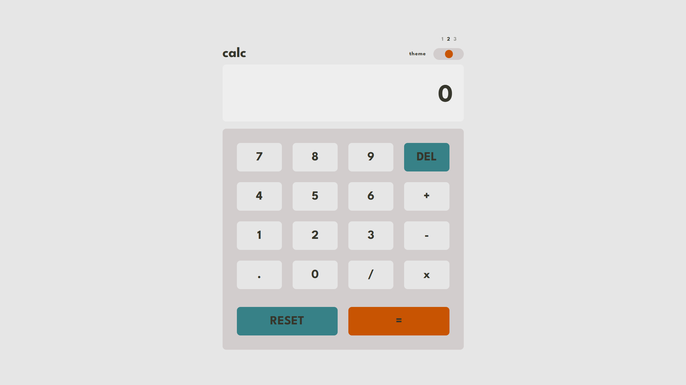
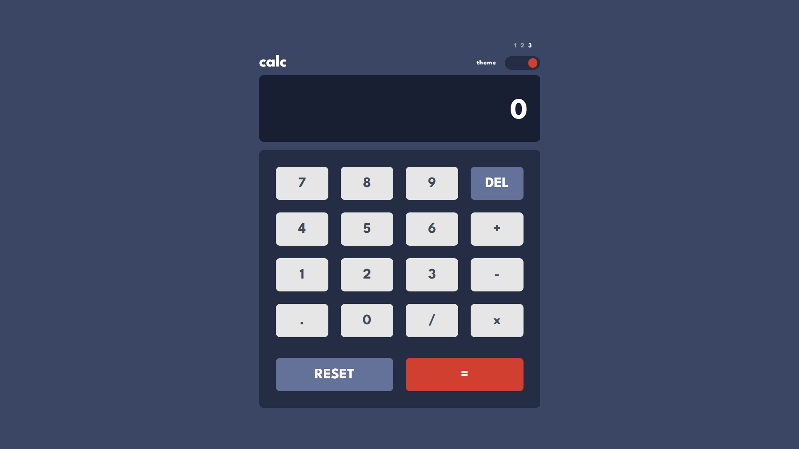

# React Calculator — JVM Launchpad Challenge

## Read this in other languages

- [Português (Brasil)](./docs/README.pt-BR.md)

This project was developed as part of a **technical challenge for joining one of the JVM Launchpad squads**.  
The goal was to build a **fully functional calculator** using **React, Vite, and TypeScript**, focusing on **code organization, standardization, and frontend best practices**.

---

## Challenge objective

- Build a functional calculator in React
- Use TypeScript with explicit typing
- Apply component-based architecture best practices
- Implement theme switching
- Maintain a consistent visual standard

---

## Features

- Basic mathematical operations:
  - Addition (`+`)
  - Subtraction (`-`)
  - Multiplication (`x`)
  - Division (`/`)
- Special keys:
  - `DEL` – removes the last character
  - `RESET` – clears the entire operation
  - `=` – executes the calculation
- Decimal number support
- Three visual themes:
  - **Dark** (primary theme using JVM Launchpad colors: black and red)
  - Light
  - Color
- Grid-based layout
- Responsive interface

---

## Technologies and tools

| Technology      | Purpose                 |
| --------------- | ----------------------- |
| React           | UI                      |
| Vite            | Project setup and build |
| TypeScript      | Static typing           |
| SCSS            | Styling                 |
| CSS Modules     | Style scoping           |
| BEM Methodology | Class naming convention |
| Prettier        | Code formatting         |

---

## Architecture and organization

- Reusable and decoupled components
- Calculation logic centralized in a **custom hook**
- Clear separation between:
  - components
  - hooks
  - types
  - utils
- Sass variables used to define the color palette
- Themes implemented using **CSS custom properties**, dynamically switched via the `data-theme` attribute
- Components consume only CSS variables, with no direct dependency on the active theme
- Calculations implemented without using `eval`

---

## Getting Started

### Prerequisites

- Node.js (>= 14.x)
- npm or yarn

### Installation

1. Clone the repository:
   ```bash
   git clone https://github.com/mari-codes/devfinder.git
   ```
2. Navigate to the project folder:
   ```bash
   cd devfinder
   ```
3. Install dependencies:

   ```bash
   npm install
   ```

   or

   ```bash
   yarn install
   ```

## Running the Project

```sh
npm run dev
```

or

```bash
yarn dev
```

---

## Themes

### 1. JVM Launchpad



### 2. Light



### 3. Color


